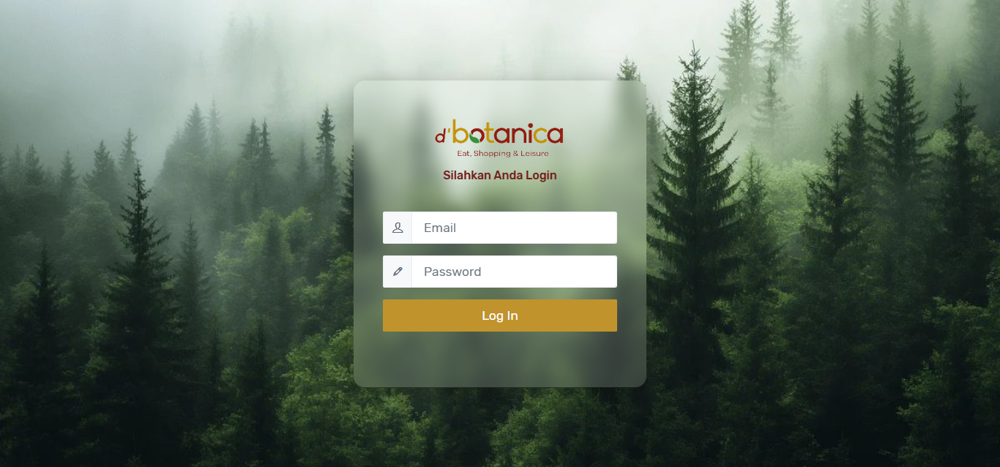

# 🏢 D'Botanica MOD Damage Report

### Perangkat Lunak Pelaporan Temuan Kerusakan Area Mall D'Botanica

> **Web-based damage reporting system** untuk membantu Manager On Duty (MOD) dalam mencatat, memantau, dan mengelola temuan kerusakan fasilitas di area Mall D'Botanica secara terstruktur dan terdokumentasi.

---

## 📌 Tentang Proyek

**D'Botanica MOD Damage Report** merupakan aplikasi berbasis web yang dikembangkan untuk mendigitalisasi proses pelaporan temuan kerusakan yang sebelumnya dapat dilakukan secara manual.

Aplikasi ini membantu **Manager On Duty (MOD) dan administrator** dalam mengelola laporan kerusakan mulai dari pencatatan temuan, proses perbaikan, hingga penyelesaian kerusakan.

Dengan adanya sistem ini, proses monitoring menjadi lebih **terstruktur, terdokumentasi, dan mudah ditelusuri**.

---

## 🎯 Tujuan

Aplikasi ini dikembangkan untuk:

* 📝 Mencatat temuan kerusakan secara digital.
* 🔧 Memantau proses perbaikan kerusakan.
* 📊 Menampilkan data dan status laporan secara terstruktur.
* 👥 Mengelola data user dan divisi.
* 📄 Menghasilkan laporan kerusakan yang dapat diunduh.
* ⏱️ Membantu meningkatkan efisiensi proses monitoring kerusakan.

---

## ✨ Fitur Utama

| Fitur                      | Deskripsi                                                  |
| -------------------------- | ---------------------------------------------------------- |
| 🔐 **Login Admin**         | Autentikasi pengguna untuk mengakses sistem                |
| 📊 **Dashboard**           | Menampilkan ringkasan data dan status kerusakan            |
| 🏢 **Master Divisi**       | Mengelola data divisi yang terlibat dalam proses perbaikan |
| 👤 **Master User**         | Mengelola data pengguna sistem                             |
| ⚠️ **Temuan Kerusakan**    | Mencatat dan mengelola temuan kerusakan                    |
| 🔧 **Perbaikan Kerusakan** | Memantau proses perbaikan berdasarkan laporan              |
| ✅ **Selesai Perbaikan**    | Menampilkan laporan kerusakan yang telah diselesaikan      |
| 📥 **Unduh Laporan**       | Mengunduh data laporan kerusakan untuk dokumentasi         |

---

## 🔄 Alur Sistem

```text
        ┌─────────────────┐
        │   Login Admin   │
        └────────┬────────┘
                 ↓
        ┌─────────────────┐
        │    Dashboard    │
        └────────┬────────┘
                 ↓
        ┌─────────────────┐
        │ Temuan Kerusakan│
        └────────┬────────┘
                 ↓
        ┌─────────────────┐
        │    Perbaikan    │
        └────────┬────────┘
                 ↓
        ┌─────────────────┐
        │ Selesai Diperbaiki│
        └────────┬────────┘
                 ↓
        ┌─────────────────┐
        │ Unduh Laporan   │
        └─────────────────┘
```

---

## 🛠️ Tech Stack

### Backend


### Database


### Frontend & UI


### Development Tools


---

# 🖥️ System Preview

## 🔐 Login Admin

Halaman autentikasi untuk membatasi akses ke dalam sistem.



---

## 📊 Dashboard Admin

Dashboard memberikan gambaran umum mengenai data dan status laporan kerusakan.


---

## 🏢 Data Master Divisi

Digunakan untuk mengelola data divisi yang terkait dengan proses penanganan kerusakan.


---

## 👤 Data Master User

Digunakan untuk mengelola pengguna yang memiliki akses terhadap sistem.


---

## ⚠️ Temuan Kerusakan

Halaman untuk mencatat dan mengelola temuan kerusakan yang ditemukan di area mall.


---

## 🔧 Perbaikan Kerusakan

Menampilkan proses penanganan dan perbaikan terhadap kerusakan yang telah dilaporkan.


---

## ✅ Selesai Perbaikan

Menampilkan data kerusakan yang telah selesai ditangani.


---

## 📥 Unduh Laporan Kerusakan

Fitur untuk menghasilkan dan mengunduh laporan kerusakan sebagai dokumentasi.


---

# 🚀 Installation

Ikuti langkah berikut untuk menjalankan project secara lokal.

### 1. Clone Repository

```bash
git clone https://github.com/putri-suci-aliyah/dbotanica-mod-damage-report.git
```

### 2. Masuk ke Folder Project

```bash
cd dbotanica-mod-damage-report
```

### 3. Install Dependency

```bash
composer install
```

### 4. Copy Environment File

```bash
cp .env.example .env
```

Untuk Windows:

```bash
copy .env.example .env
```

### 5. Generate Application Key

```bash
php artisan key:generate
```

### 6. Konfigurasi Database

Buat database MySQL, kemudian sesuaikan konfigurasi pada file `.env`.

```env
DB_DATABASE=[nama_database]
DB_USERNAME=root
DB_PASSWORD=
```

### 7. Jalankan Migration

```bash
php artisan migrate
```

Jika project menggunakan seeder:

```bash
php artisan db:seed
```

### 8. Jalankan Laravel

```bash
php artisan serve
```

Kemudian buka:

```text
http://127.0.0.1:8000
```

---

# 📂 Project Structure

Struktur utama aplikasi menggunakan konsep **MVC (Model-View-Controller)** dari Laravel.

```text
dbotanica-mod-damage-report/
│
├── app/
│   ├── Http/
│   │   ├── Controllers/
│   │   └── Middleware/
│   │
│   └── Models/
│
├── database/
│   ├── migrations/
│   └── seeders/
│
├── public/
│   └── img/
│
├── resources/
│   └── views/
│
├── routes/
│   └── web.php
│
├── .env.example
├── composer.json
└── README.md
```

---

# 👩‍💻 Role & Contribution

**Role:** Full-Stack Web Developer

### Responsibilities

* Menganalisis kebutuhan sistem pelaporan kerusakan.
* Merancang struktur database MySQL.
* Mengembangkan backend menggunakan Laravel 10.
* Mengembangkan tampilan antarmuka menggunakan AdminLTE.
* Mengimplementasikan CRUD data master.
* Mengembangkan proses pencatatan dan monitoring kerusakan.
* Mengimplementasikan proses status perbaikan.
* Mengembangkan fitur laporan dan download data.
* Melakukan testing dan debugging aplikasi.

---

# 📈 Future Development

Beberapa pengembangan yang dapat dilakukan pada versi berikutnya:

* 🔔 Notifikasi ketika terdapat laporan kerusakan baru.
* 📱 Responsive interface untuk perangkat mobile.
* 📊 Statistik dan visualisasi laporan kerusakan yang lebih lengkap.
* 👥 Role-based access control untuk berbagai jenis pengguna.
* 📷 Upload foto sebagai bukti kondisi kerusakan.
* 🔎 Advanced search dan filtering laporan.
* 📧 Notifikasi melalui email atau WhatsApp.
* 📋 Audit trail untuk mencatat aktivitas pengguna.

---

# 📄 Project Information

| Informasi                | Detail                       |
| ------------------------ | ---------------------------- |
| **Project**              | D'Botanica MOD Damage Report |
| **Type**                 | Web Application              |
| **Framework**            | Laravel 10                   |
| **Programming Language** | PHP                          |
| **Database**             | MySQL                        |
| **UI Template**          | AdminLTE                     |
| **Architecture**         | MVC                          |
| **Platform**             | Web                          |
| **Development Role**     | Full-Stack Web Developer     |

---

## ⭐ Project Highlights

> **Digitalisasi proses pelaporan kerusakan fasilitas** dari pencatatan temuan hingga penyelesaian perbaikan dalam satu sistem terintegrasi.

**Key Value:**

`Digital Reporting` · `Damage Monitoring` · `Data Management` · `Reporting` · `Laravel MVC`

---

## 📬 Contact

Jika ingin berdiskusi mengenai project ini atau peluang kolaborasi, silakan hubungi saya melalui GitHub.

**Developed by Suci Aliyah Putri**
*Informatics Student | Web Developer*
